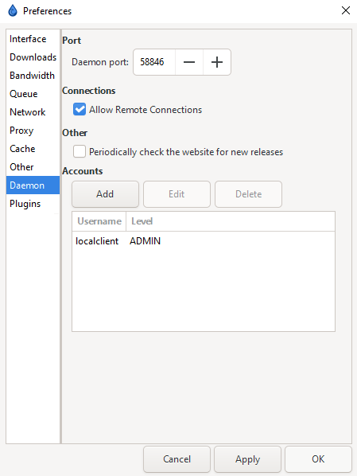
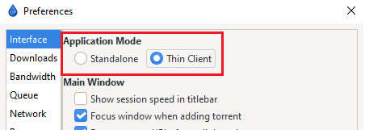
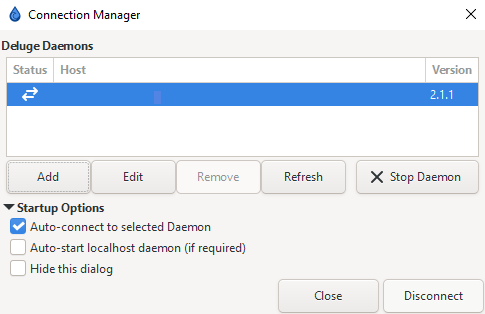

# Tips

## Thin Client

### Daemon

If you are already running Deluge in `daemon` or `console` mode, or in docker, this is enabled by default. You will need to check your compose or core.conf for the "daemon_port" if you do not know it already.

!!! tip
    You can also access the daemon settings in `preferences` in the WebUI if you do not have access to the GTK/UI

You will need to have "Allow Remote Connections" enabled if you are not connecting to Deluge from localhost.

!!! info
     If you do not have access to the WebUI, and are instead doing this by editing Deluge's `core.conf`, you will need to change "allow_remote" to true.

     Restart Deluge for the changes to take effect.

------

### Switching to Thin-Client

Once your daemon is setup and running, it's time to setup the client you'll be using to manage your daemon. This will usually be on a remote computer, but if you wish to run this way locally to always seed in the background, that works as well.

Simply go to `Edit` => `Preferences` and switch from `Standalone` to `Thin Client`

Restart Deluge.

#### Connections Manager

After switching to `Thin Client` you will need to connect to your daemon. Go to `Edit` => `Connections Manager` and click on `Add` to add the daemon.

!!! ATTENTION
    If you mistype your password, it will prompt you to enter it. There is a bug that does not accept the correct password unless it is entered through the `Add`/`Edit` Menu. If you do not enter the correct password when adding, go to `Edit` on the connection and retype the password into the password blank.

!!! WARNING
    You can find your users and passwords for logging into the daemon in the `auth` file inside your data/config folder for Deluge. You can add users in the `Daemon` settings in preferences as well.

    BE AWARE: These password are stored in PLAIN-TEXT in your `auth` file.

## Plugins

Here you will find a list of included and available plugins that may be useful. These are not required, but should be seen as ways to advance/customize your setup once you understand the client and its behaviors.

!!! info
    All plugins are .egg files, these files will need to be placed inside your deluge config/data directory, inside the `plugins` folder. If you are using a thin client, they will also need to be present on your local instance as well.

!!! tip
    Links to the plugins below are directly to the latest versions available on Deluge's forums, see the original and subsequent posts for more information concerning the plugin's features and iterations.

------

### AutoAdd

Use this plugin as a "Watch" directory for .torrent files, you can customize the settings using the `Edit` button for that specific directory (download directory, label, etc).

Place a .torrent file in a watched folder, and Deluge will add the torrent to your client. Make sure your directory is marked with a checkmark under `Active` if you wish it to be monitored.

------

### AddTorrentCheck

This plugin is used to continuously update the tracker when adding torrents from IRC (think autodl-irssi or autobrr) before they are registered.

See the forum thread for details below.

[AddTorrentCheck](https://forum.deluge-torrent.org/viewtopic.php?p=236070#p236070){:target="_blank" rel="noopener noreferrer"}

------

### Blocklist

This plugin has mixed reception, depending on the use case. For private trackers, it is generally recommended to keep it disabled. There is an argument that some benefits, in privacy/security, could be made for public trackers - however, reports of many false positives and actual TRACKERS being flagged/blocked have been reported.

Use at your own discretion.

------

### Execute

Execute will run a program or script upon reaching a specified event. It is recommended that after adding events, you restart Deluge.

!!! info
    Checking or Rechecking a torrent will not trigger the "Torrent Completed" event, you will need to actually download the torrent to trigger this.

------

### Stats

Stats plugin does exactly what it sounds like, provides you statistics on traffic for torrents. You can find the latest version on the forums, but depending on which version of Deluge you install an older version may be included.

[Stats](https://forum.deluge-torrent.org/viewtopic.php?p=236443#p236443){:target="_blank" rel="noopener noreferrer"}

------

### YaRSS2

YaRSS2 should be considered unsupported/abandoned at this point. This plugin will crash your client after a random amount of time.

There is not currently any active development on the project, as far as I'm aware.

There is currently no viable RSS support natively in Deluge.

------

### AutoRemovePlus

This is one of the forks of the original AutoRemovePlus (also referred to as ARP) which will automatically remove torrents from your client:

- Select how many torrents are allowed at the same time.
- Choose to remove or pause them based on multiple criteria age, seeders, seed time or ratio.
- Set specific removal rules depending on tracker or LabelPlus label.
- Remove only torrents from specific trackers or LabelPlus labels.
- Only remove torrents if under a certain HDD space threshold.
- Select if torrents have to fulfill both or either criteria.
- Delete torrents in order (e.g. delete torrents with highest ratio first).
- Don't remove torrents if they don't reach a minimum time (in days) or ratio.
- Choose the removal interval.
- Right click and select torrents that you don't want automatically removed.
- Remove torrent data option.
- Create an exempted tracker or LabelPlus label list, so that torrents that belong to those trackers or labels are not removed.
- Fully functional WebUI.

Other forks, and the original plugin, can be found on the GitHub page.

[AutoRemovePlus](https://github.com/laur89/deluge-autoremoveplus){:target="_blank" rel="noopener noreferrer"}

------

### ltConfig

If you need to set libtorrent settings to anything other than their defaults, this is the plugin for you. There are presets, but you can fine-tune the settings as you need as well.

!!! ATTENTION
    There is a known bug when trying to enable settings in ltConfig, double-clicking will sometimes not "check" the option.

    Simply click the option, then use the space bar to enable that checkbox.
!!! tips
    If you want to seed over 1600 torrents, you will need this plugin. You will need to increase the active_tracker_limit.

    If your tracker's SSL certificate has expired, you can disable validate_https_trackers to bypass validation.

See the forum thread for details below.

[ltConfig](https://forum.deluge-torrent.org/viewtopic.php?p=235653#p235653){:target="_blank" rel="noopener noreferrer"}

------

{! include-markdown "../../../includes/support.md" !}
<!-- --8<-- "includes/support.md" -->
